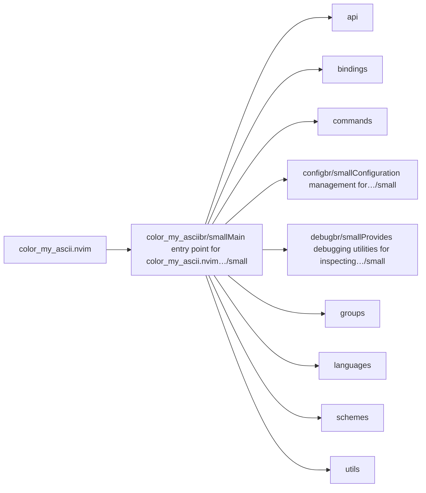
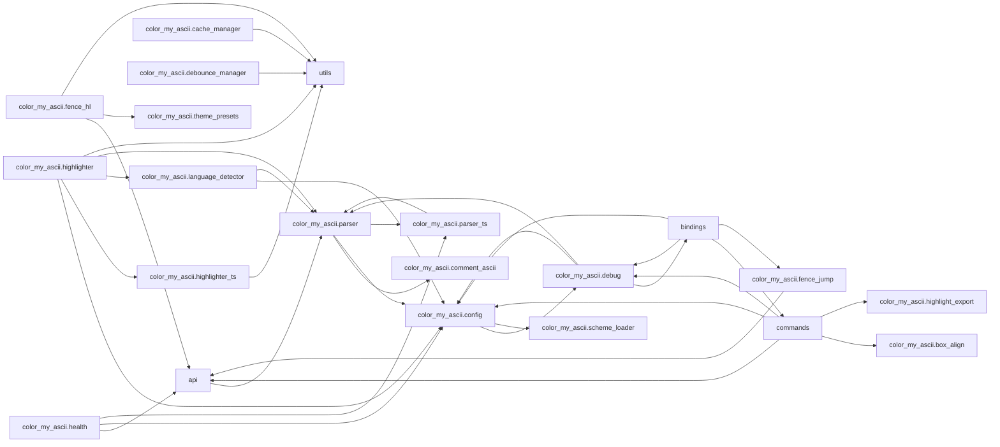

# color_my_ascii.nvim — module map

> **Generated** by `documentation`. Do not edit by hand — run `:DocMap`
> (or `nvim --headless -l scripts/gen_map.lua`) to regenerate.

**4 modules** · 8 namespaces · 89 helper files

The [interactive map](index.html) has filtering, full descriptions and
source links; this page is the version the code host renders directly.

## Namespaces

## Dependencies

Which parts of the tree require which, rolled up to the second level.
The [interactive map](index.html)'s **Deps** view has this per module,
in both directions, with load-time and lazy requires told apart.

## Modules

| Module | Description | Fns | Docs |
|---|---|---|---|
| `color_my_ascii` | Main entry point for color_my_ascii.nvim plugin. | 11 | [src](../../lua/color_my_ascii/init.lua) |
| &nbsp;&nbsp;`api` |  |  |  |
| &nbsp;&nbsp;`bindings` |  |  |  |
| &nbsp;&nbsp;`commands` |  |  |  |
| &nbsp;&nbsp;&nbsp;&nbsp;`color_my_ascii.commands.fence` | Buffer-local `:Fence  [args]` dispatcher. | 7 | [src](../../lua/color_my_ascii/commands/fence/init.lua) |
| &nbsp;&nbsp;`color_my_ascii.config` | Configuration management for color_my_ascii.nvim plugin. | 15 | [src](../../lua/color_my_ascii/config/init.lua) |
| &nbsp;&nbsp;`color_my_ascii.debug` | Provides debugging utilities for inspecting configuration, groups, and character mappings. | 4 | [src](../../lua/color_my_ascii/debug/init.lua) |
| &nbsp;&nbsp;`groups` |  |  |  |
| &nbsp;&nbsp;`languages` |  |  |  |
| &nbsp;&nbsp;`schemes` |  |  |  |
| &nbsp;&nbsp;`utils` |  |  |  |

## Drift

0 errors · 1 warnings · 55 info

| Severity | Check | Message |
|---|---|---|
| warn | `doc-references-missing` | docs/ROADMAP/lsp_integration_fence.md:111 references 'color_my_ascii.embedded', but color_my_ascii has no 'embedded' |

55 informational findings

| Check | Message |
|---|---|
| `missing-readme` | lua/color_my_ascii has no README.md |
| `missing-readme` | lua/color_my_ascii/commands/fence has no README.md |
| `missing-readme` | lua/color_my_ascii/config has no README.md |
| `missing-readme` | lua/color_my_ascii/debug has no README.md |
| `undocumented-param` | M.complete has 3 parameter(s) but only 2 @param line(s) |
| `undocumented-param` | M.filetype_for has 1 parameter(s) but only 0 @param line(s) |
| `unreferenced-module` | color_my_ascii.@types is required by no other file in the tree |
| `unreferenced-module` | color_my_ascii.debug.@types is required by no other file in the tree |
| `unreferenced-module` | color_my_ascii.groups.arrows is required by no other file in the tree |
| `unreferenced-module` | color_my_ascii.groups.blocks is required by no other file in the tree |
| `unreferenced-module` | color_my_ascii.groups.box_drawing is required by no other file in the tree |
| `unreferenced-module` | color_my_ascii.groups.operators is required by no other file in the tree |
| `unreferenced-module` | color_my_ascii.groups.symbols is required by no other file in the tree |
| `unreferenced-module` | color_my_ascii.health is required by no other file in the tree |
| `unreferenced-module` | color_my_ascii.languages.bash is required by no other file in the tree |
| `unreferenced-module` | color_my_ascii.languages.c is required by no other file in the tree |
| `unreferenced-module` | color_my_ascii.languages.clojure is required by no other file in the tree |
| `unreferenced-module` | color_my_ascii.languages.cpp is required by no other file in the tree |
| `unreferenced-module` | color_my_ascii.languages.csharp is required by no other file in the tree |
| `unreferenced-module` | color_my_ascii.languages.css is required by no other file in the tree |
| `unreferenced-module` | color_my_ascii.languages.dart is required by no other file in the tree |
| `unreferenced-module` | color_my_ascii.languages.elixir is required by no other file in the tree |
| `unreferenced-module` | color_my_ascii.languages.go is required by no other file in the tree |
| `unreferenced-module` | color_my_ascii.languages.groovy is required by no other file in the tree |
| `unreferenced-module` | color_my_ascii.languages.haskell is required by no other file in the tree |
| `unreferenced-module` | color_my_ascii.languages.html is required by no other file in the tree |
| `unreferenced-module` | color_my_ascii.languages.java is required by no other file in the tree |
| `unreferenced-module` | color_my_ascii.languages.javascript is required by no other file in the tree |
| `unreferenced-module` | color_my_ascii.languages.json is required by no other file in the tree |
| `unreferenced-module` | color_my_ascii.languages.kotlin is required by no other file in the tree |
| `unreferenced-module` | color_my_ascii.languages.llvm is required by no other file in the tree |
| `unreferenced-module` | color_my_ascii.languages.lua is required by no other file in the tree |
| `unreferenced-module` | color_my_ascii.languages.perl is required by no other file in the tree |
| `unreferenced-module` | color_my_ascii.languages.php is required by no other file in the tree |
| `unreferenced-module` | color_my_ascii.languages.powershell is required by no other file in the tree |
| `unreferenced-module` | color_my_ascii.languages.python is required by no other file in the tree |
| `unreferenced-module` | color_my_ascii.languages.r is required by no other file in the tree |
| `unreferenced-module` | color_my_ascii.languages.ruby is required by no other file in the tree |
| `unreferenced-module` | color_my_ascii.languages.rust is required by no other file in the tree |
| `unreferenced-module` | color_my_ascii.languages.scala is required by no other file in the tree |
| `unreferenced-module` | color_my_ascii.languages.sql is required by no other file in the tree |
| `unreferenced-module` | color_my_ascii.languages.swift is required by no other file in the tree |
| `unreferenced-module` | color_my_ascii.languages.typescript is required by no other file in the tree |
| `unreferenced-module` | color_my_ascii.languages.vim is required by no other file in the tree |
| `unreferenced-module` | color_my_ascii.languages.zig is required by no other file in the tree |
| `unreferenced-module` | color_my_ascii.schemes.catppuccin is required by no other file in the tree |
| `unreferenced-module` | color_my_ascii.schemes.default is required by no other file in the tree |
| `unreferenced-module` | color_my_ascii.schemes.dracula is required by no other file in the tree |
| `unreferenced-module` | color_my_ascii.schemes.gruvbox is required by no other file in the tree |
| `unreferenced-module` | color_my_ascii.schemes.matrix is required by no other file in the tree |
| `unreferenced-module` | color_my_ascii.schemes.monokai is required by no other file in the tree |
| `unreferenced-module` | color_my_ascii.schemes.nord is required by no other file in the tree |
| `unreferenced-module` | color_my_ascii.schemes.onedark is required by no other file in the tree |
| `unreferenced-module` | color_my_ascii.schemes.solarized is required by no other file in the tree |
| `unreferenced-module` | color_my_ascii.schemes.tokyonight is required by no other file in the tree |

